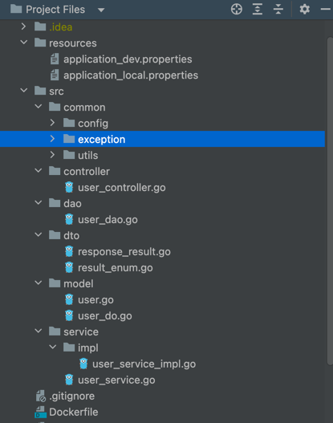

类似于springboot开发风格的框架。

基于Golang 版本 1.18.4

Galaxy Go Framework
主要功能：

1. 支持 基于nacos的配置中心，注册中心
2. 支持 多源mysql
3. 支持 多源redis
4. 支持 多源mongodb
5. 支持 连接池
6. 支持 日志安大小切分
7. 支持 XXL-Job 分布式任务调度
中间件：

1. 支持 rabbitmq 
2. ES 开发中
3. kafka 开发中
