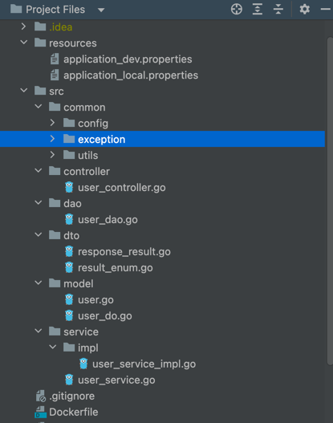

类似于springboot开发风格的框架,易于招人,市场上java开发还是比较好找的。

基于Golang 版本 1.18.4

Galaxy Go Framework
主要功能：

1. 支持 基于nacos的配置中心，注册中心
2. 支持 多源mysql
3. 支持 多源redis
4. 支持 多源mongodb
5. 支持 连接池

中间件：

1. rabbitmq 开发中
2. ES 开发中
3. kafka 开发中
